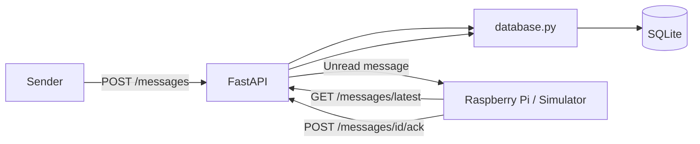
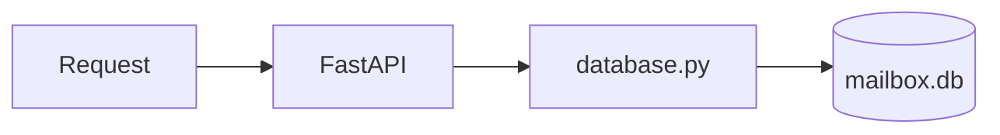
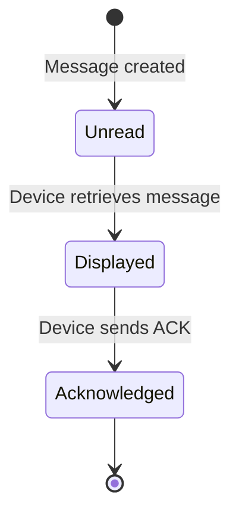
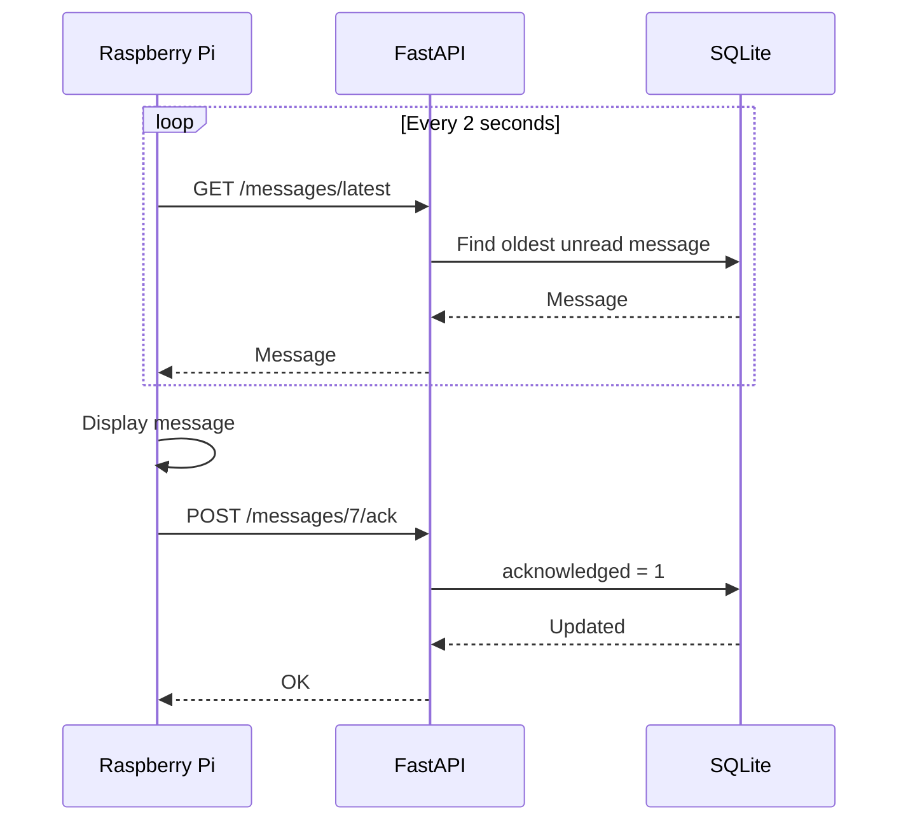
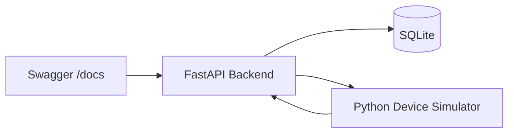
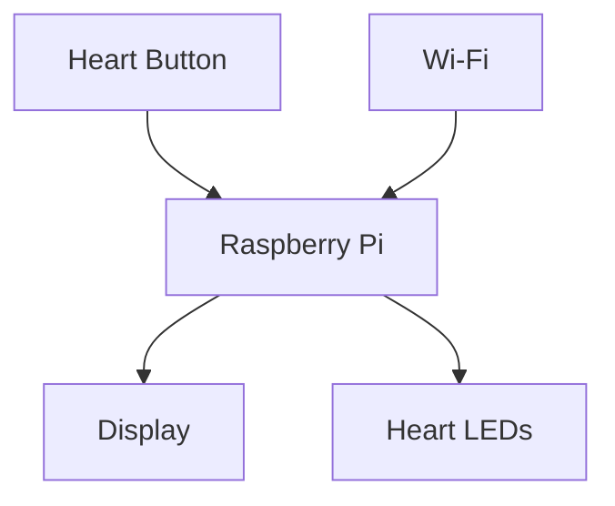
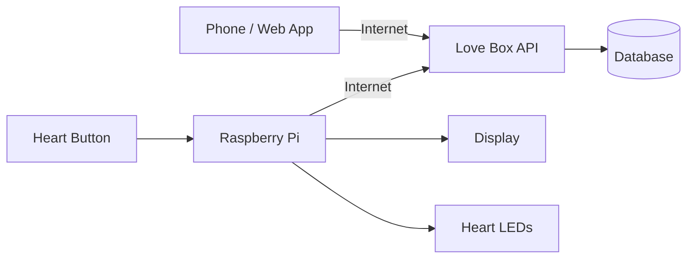
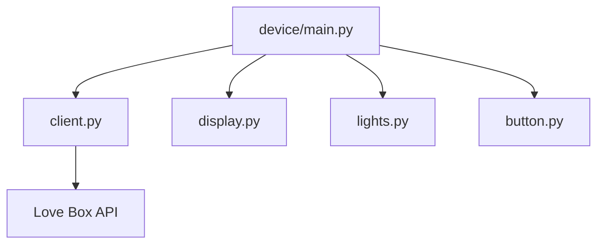
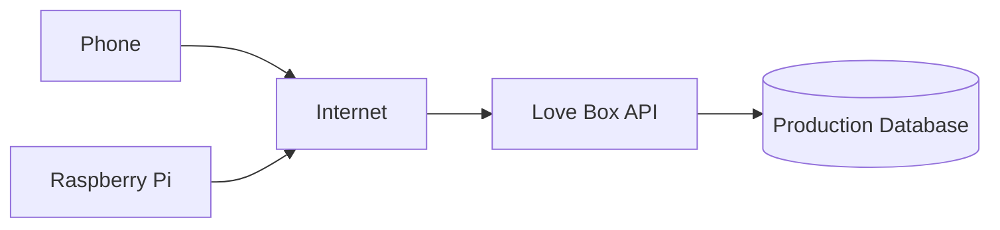
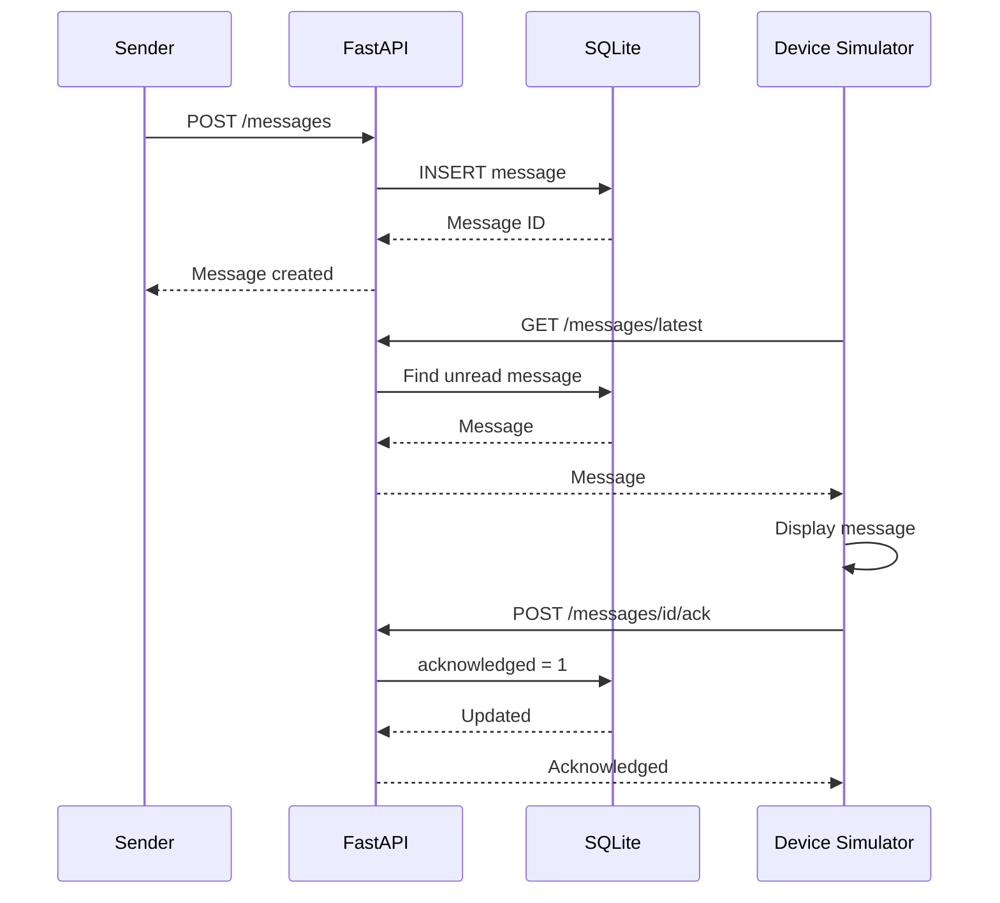

# Love Box – Architecture

Love Box is a connected physical message box designed to receive personal messages such as compliments, date plans, surprises, and reminders.

The final device will use a Raspberry Pi connected to a display, LEDs, and physical controls.

The project is currently split into three main parts:

* Backend API
* Persistent message storage
* Raspberry Pi / device client

---

## 1. Current Architecture

The current system consists of a FastAPI backend, a SQLite database, and a Python program that simulates the future Raspberry Pi.



The sender currently uses FastAPI's Swagger interface for testing.

Later, Swagger will be replaced by a dedicated web or mobile interface.

The Raspberry Pi is currently represented by a Python simulator running on the development machine.

This allows the backend and communication protocol to be developed before the physical hardware is available.

---

# 2. Backend Structure

The backend currently looks approximately like this:

```text
backend/
├── app/
│   ├── main.py
│   ├── database.py
│   └── models.py
│
├── mailbox.db
└── requirements.txt
```

Each file has a specific responsibility.

---

## main.py

`main.py` contains the HTTP API.

It is responsible for:

* Receiving HTTP requests
* Calling the appropriate database function
* Returning HTTP responses
* Defining the available API endpoints

Database queries are intentionally kept outside `main.py`.



This separation makes the backend easier to understand and allows the database implementation to change later without rewriting the entire API.

---

## database.py

`database.py` handles communication with SQLite.

Its current responsibilities include:

* Opening database connections
* Creating the messages table
* Migrating the database when new columns are introduced
* Creating messages
* Retrieving all messages
* Retrieving the next unread message
* Marking messages as acknowledged

The SQLite database is stored locally as:

```text
backend/mailbox.db
```

This file should not be committed to Git because it contains local runtime data.

---

## models.py

`models.py` contains the data models used by FastAPI.

For example, a new message currently contains:

```json
{
  "title": "Date night ❤️",
  "body": "Be ready at 18:00"
}
```

FastAPI uses the model to validate incoming requests before passing the data further into the application.

---

# 3. Message Storage

Messages are currently stored in a SQLite table called:

```text
messages
```

The table currently contains approximately the following structure:

| Column         | Type    | Purpose                                      |
| -------------- | ------- | -------------------------------------------- |
| `id`           | INTEGER | Unique message ID                            |
| `title`        | TEXT    | Message title                                |
| `body`         | TEXT    | Message content                              |
| `acknowledged` | INTEGER | Whether the device has processed the message |

Each message automatically receives a unique ID.

For example:

```text
id: 7
title: Hei ❤️
body: Dette er første melding til simulatoren
acknowledged: 0
```

---

# 4. Message Lifecycle

Every new message starts with:

```text
acknowledged = 0
```

This means that the Love Box has not processed the message yet.



When the device has processed the message, it calls:

```text
POST /messages/{message_id}/ack
```

The backend then changes:

```text
acknowledged = 0
```

to:

```text
acknowledged = 1
```

The message remains stored in the database, but the device will no longer treat it as a new message.

---

# 5. Message Queue

The device requests the oldest unread message.

The backend uses the equivalent of:

```sql
WHERE acknowledged = 0
ORDER BY id ASC
LIMIT 1
```

This creates a simple message queue.

Imagine that the Love Box has been offline and three messages have arrived:

```text
Message #7
Message #8
Message #9
```

The device processes them in order:

```text
#7
 ↓
Display
 ↓
ACK

#8
 ↓
Display
 ↓
ACK

#9
 ↓
Display
 ↓
ACK
```

This prevents messages from being skipped when the device has been disconnected.

---

# 6. Device Polling

The Raspberry Pi does not currently require a permanent connection to the backend.

Instead, it polls the server periodically.

The current simulator polls approximately every two seconds.



If no unread message exists, the API returns no message and the device waits until the next polling cycle.

---

# 7. Current API

The backend currently exposes the following endpoints:

| Method | Endpoint             | Purpose                              |
| ------ | -------------------- | ------------------------------------ |
| `GET`  | `/health`            | Check whether the backend is running |
| `POST` | `/messages`          | Create a new message                 |
| `GET`  | `/messages`          | Retrieve all messages                |
| `GET`  | `/messages/latest`   | Retrieve the next unread message     |
| `POST` | `/messages/{id}/ack` | Mark a message as acknowledged       |

During development, these endpoints can be tested through FastAPI Swagger:

```text
http://127.0.0.1:8000/docs
```

---

# 8. Current Development Environment

Everything currently runs locally on the development machine.



Two processes are normally running during development.

### Backend

```text
FastAPI
+
SQLite
```

### Device simulator

```text
device_simulator.py
```

The simulator behaves like the future Raspberry Pi.

It:

1. Polls the backend
2. Checks for unread messages
3. Displays the message
4. Sends an acknowledgement
5. Waits for the next message

---

# 9. Current Device Simulator

The current Raspberry Pi simulator runs as a normal Python application.

Conceptually, it performs the following loop:

```text
START
  │
  ▼
Ask backend for message
  │
  ▼
Message available?
  │
  ├── NO ──────► Wait 2 seconds
  │                  │
  │                  └──────► Try again
  │
  └── YES
       │
       ▼
   Display message
       │
       ▼
    Send ACK
       │
       ▼
  Wait 2 seconds
       │
       └────────────► Try again
```

The terminal currently represents the physical display.

For example:

```text
==================================================
💗 LOVE BOX 💗
==================================================

Hei ❤️

Dette er første melding til simulatoren

==================================================

Message #7 acknowledged ✅
```

Later, the terminal output will be replaced by an actual graphical display.

---

# 10. Why Use a Simulator?

Using a simulator allows most of the software to be developed before purchasing or configuring the physical Raspberry Pi.

The goal is for the same basic device logic to eventually run on the Raspberry Pi.

Today:

```text
Python
  ↓
Terminal
```

Later:

```text
Python
  ↓
Raspberry Pi
  ↓
Physical Display
```

The networking and API communication should remain largely the same.

Only the hardware-specific components need to change.

---

# 11. Target Device Architecture

The physical Love Box will eventually contain several components.



The Raspberry Pi acts as the controller.

It will be responsible for:

* Connecting to the internet
* Communicating with the Love Box API
* Receiving messages
* Rendering messages
* Controlling LEDs
* Reading button input
* Acknowledging messages

---

# 12. Target System Architecture

The final system will eventually look approximately like this:



This separates the project into two major sides.

---

## Sender

The sender uses a web or mobile application.

The application will allow the sender to create different kinds of messages.

Examples:

```text
💗 Compliment

📅 Date Plan

🎁 Surprise

💌 Normal Message
```

The sender application communicates with the Love Box backend.

---

## Receiver

The receiver is the physical Love Box.

The Raspberry Pi periodically checks the backend for new messages.

When a message arrives, the box can eventually:

```text
New message
     ↓
LED hearts illuminate
     ↓
Display wakes up
     ↓
Animation plays
     ↓
Message appears
     ↓
Receiver interacts with box
     ↓
Message acknowledged
```

---

# 13. Future Display System

The current terminal display will eventually be replaced by a graphical display system.

The device code should therefore eventually be separated into components such as:

```text
device/
├── main.py
├── client.py
├── display.py
├── lights.py
└── button.py
```

### client.py

Responsible for communication with the backend.

### display.py

Responsible for rendering messages and animations.

### lights.py

Responsible for controlling LEDs.

### button.py

Responsible for physical button input.

### main.py

Coordinates all device components.

Conceptually:



This structure allows hardware implementations to change without changing the entire application.

---

# 14. Planned Message Experience

The current simulator acknowledges messages immediately after displaying them.

This is useful during early development but will probably change.

A more interactive final experience could be:

```text
Message arrives
      ↓
Hearts begin glowing
      ↓
Screen shows notification
      ↓
User presses heart button
      ↓
Message opens
      ↓
User finishes reading
      ↓
ACK sent to backend
```

This makes acknowledgement represent an actual interaction rather than simply successful network delivery.

---

# 15. Future Message Types

Currently every message consists of:

```text
title
body
```

Later, messages could contain a type.

For example:

```json
{
  "type": "date",
  "title": "Date night ❤️",
  "body": "Be ready at 18:00"
}
```

Possible types include:

```text
message
compliment
date
surprise
reminder
```

The display could render each type differently.

For example, a date plan could eventually contain:

```text
❤️ DATE NIGHT ❤️

18:00
Dinner

20:00
Activity

22:00
Surprise
```

while a compliment could use a simpler animated presentation.

---

# 16. Cloud Architecture

The backend currently runs on localhost:

```text
127.0.0.1:8000
```

This means only applications running on the same machine can access it directly.

Eventually, the backend needs to run on infrastructure accessible through the internet.



This will allow:

```text
Sender's phone
      ↓
Internet
      ↓
Love Box API
      ↓
Internet
      ↓
Love Box at receiver's home
```

The physical distance between sender and receiver will therefore not matter.

---

# 17. Security

The current development API has no authentication.

That is acceptable during local development but must change before internet deployment.

Future security work will likely include:

* HTTPS
* User authentication
* Device authentication
* Device registration
* API authorization
* Secret management
* Input validation
* Rate limiting

A Raspberry Pi should eventually have its own device identity or token.

Conceptually:

```text
Raspberry Pi
     │
     │ Device Token
     ▼
Love Box API
     │
     ▼
Authorized?
  │       │
 YES      NO
  │       │
  ▼       ▼
Message   Reject
```

---

# 18. Development Roadmap

## Phase 1 – Foundation

* [x] Create Git repository
* [x] Create Python virtual environment
* [x] Configure `.gitignore`
* [x] Create FastAPI backend
* [x] Create health endpoint
* [x] Create message model
* [x] Add SQLite database
* [x] Add persistent messages
* [x] Separate API and database logic
* [x] Add message retrieval
* [x] Add latest-message endpoint
* [x] Add acknowledgement status
* [x] Add database migration
* [x] Add acknowledgement endpoint
* [x] Create Raspberry Pi simulator
* [x] Test complete message flow

---

## Phase 2 – Device Experience

* [ ] Refactor simulator into device modules
* [ ] Create graphical display simulator
* [ ] Design Love Box message screen
* [ ] Add message animations
* [ ] Add simulated heart button
* [ ] Add simulated LEDs
* [ ] Define display states
* [ ] Handle offline mode
* [ ] Handle API reconnects

---

## Phase 3 – Sender Experience

* [ ] Create sender web application
* [ ] Design message composer
* [ ] Add message types
* [ ] Add compliment layout
* [ ] Add date-plan layout
* [ ] Add surprise layout
* [ ] Add message history
* [ ] Add delivery status

---

## Phase 4 – Raspberry Pi

* [ ] Select Raspberry Pi model
* [ ] Select display
* [ ] Configure Raspberry Pi OS
* [ ] Deploy device application
* [ ] Connect physical display
* [ ] Add GPIO support
* [ ] Connect LEDs
* [ ] Connect heart button
* [ ] Configure application auto-start
* [ ] Test power-loss recovery

---

## Phase 5 – Infrastructure

* [ ] Deploy backend to cloud
* [ ] Configure domain
* [ ] Configure HTTPS
* [ ] Add authentication
* [ ] Add device registration
* [ ] Replace development database if necessary
* [ ] Add logging
* [ ] Add monitoring
* [ ] Add backups

---

# 19. Current Status

The core communication architecture is working.

The following flow has been tested successfully:



This means the fundamental backend-to-device communication is now functional.

The next major development area is the **device experience and visual presentation**.

---

# 20. Project Vision

The goal is to move from the current development system:

```text
Swagger
   ↓
FastAPI
   ↓
SQLite
   ↑
Python Simulator
   ↓
Terminal
```

to:

```text
Beautiful sender app
        ↓
     Internet
        ↓
   Love Box API
        ↓
     Internet
        ↓
   Raspberry Pi
     ↙   ↓   ↘
 Hearts Screen Button
```

The backend and message protocol being developed now form the foundation for the physical Love Box.
