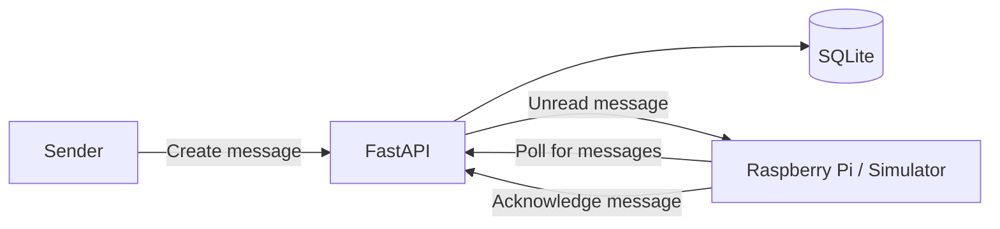

# Love Box – Architecture

Love Box is a connected physical message box designed to receive personal messages such as compliments, date plans, surprises, and reminders.

The system consists of a FastAPI backend, persistent message storage, and a Python client that currently simulates the future Raspberry Pi device.

## Documentation

The architecture documentation is divided by topic:

| Document | Contents |
| --- | --- |
| [Current system](current-system.md) | Backend structure, database, message lifecycle, queue, polling, and API |
| [Device](device.md) | Simulator, Raspberry Pi architecture, display system, and planned message experience |
| [Deployment and security](deployment-and-security.md) | Cloud deployment, internet access, authentication, and device security |
| [Roadmap](roadmap.md) | Development phases, current status, and the long-term project vision |

## Suggested reading order

Start with the [current system](current-system.md) to understand what is implemented today. Continue with the [device architecture](device.md), then read about [deployment and security](deployment-and-security.md). The [roadmap](roadmap.md) shows what has been completed and what comes next.
