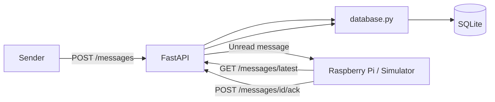
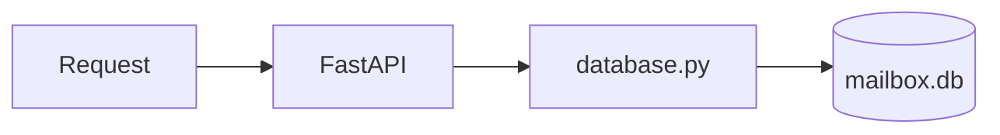
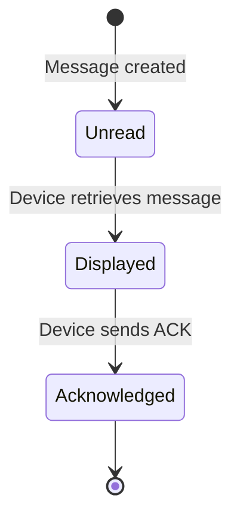
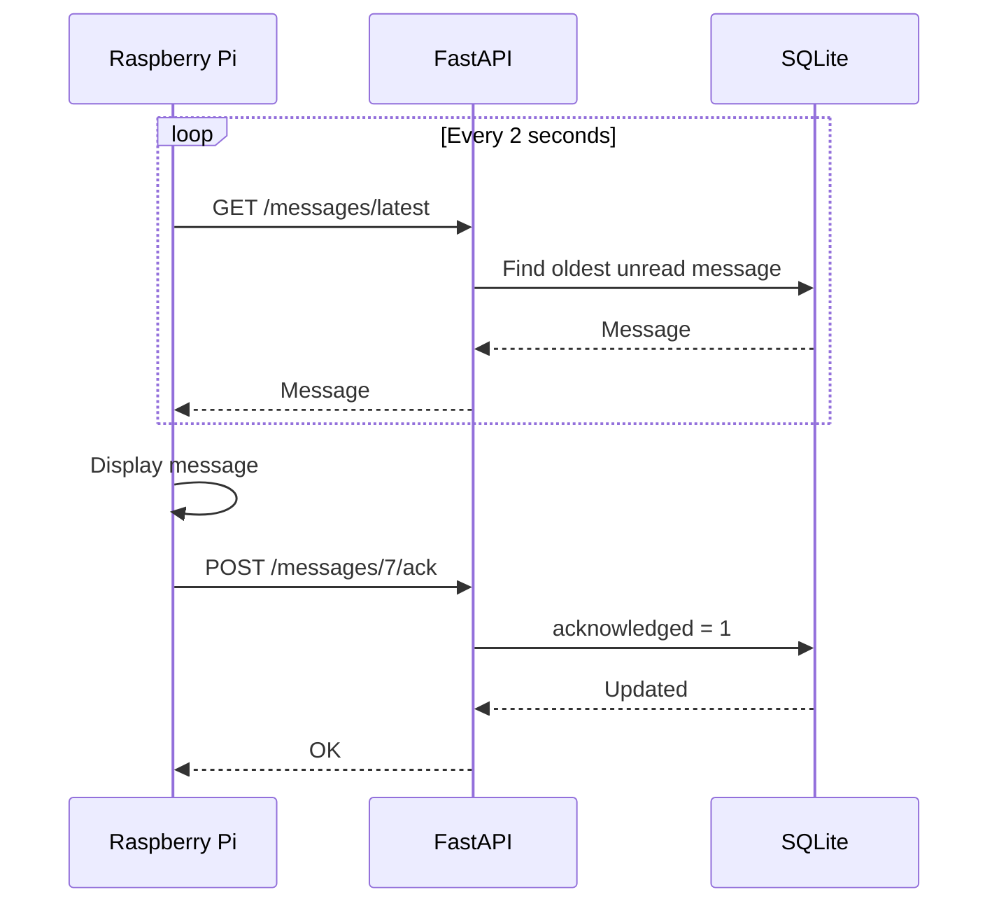

# Current System

Love Box is a connected physical message box designed to receive personal messages such as compliments, date plans, surprises, and reminders.

The final device will use a Raspberry Pi connected to a display, LEDs, and physical controls.

The project is currently split into three main parts:

* Backend API
* Persistent message storage
* Raspberry Pi / device client

---

## Architecture Overview

The current system consists of a FastAPI backend, a SQLite database, and a Python program that simulates the future Raspberry Pi.



The sender currently uses FastAPI's Swagger interface for testing.

Later, Swagger will be replaced by a dedicated web or mobile interface.

The Raspberry Pi is currently represented by a Python simulator running on the development machine.

This allows the backend and communication protocol to be developed before the physical hardware is available.

---

## Backend Structure

The backend currently looks approximately like this:

```text
backend/
├── app/
│   ├── main.py
│   ├── database.py
│   └── models.py
│
├── mailbox.db
└── requirements.txt
```

Each file has a specific responsibility.

---

### main.py

`main.py` contains the HTTP API.

It is responsible for:

* Receiving HTTP requests
* Calling the appropriate database function
* Returning HTTP responses
* Defining the available API endpoints

Database queries are intentionally kept outside `main.py`.



This separation makes the backend easier to understand and allows the database implementation to change later without rewriting the entire API.

---

### database.py

`database.py` handles communication with SQLite.

Its current responsibilities include:

* Opening database connections
* Creating the messages table
* Migrating the database when new columns are introduced
* Creating messages
* Retrieving all messages
* Retrieving the next unread message
* Marking messages as acknowledged

The SQLite database is stored locally as:

```text
backend/mailbox.db
```

This file should not be committed to Git because it contains local runtime data.

---

### models.py

`models.py` contains the data models used by FastAPI.

For example, a new message currently contains:

```json
{
  "title": "Date night ❤️",
  "body": "Be ready at 18:00"
}
```

FastAPI uses the model to validate incoming requests before passing the data further into the application.

---

## Message Storage

Messages are currently stored in a SQLite table called:

```text
messages
```

The table currently contains approximately the following structure:

| Column         | Type    | Purpose                                      |
| -------------- | ------- | -------------------------------------------- |
| `id`           | INTEGER | Unique message ID                            |
| `title`        | TEXT    | Message title                                |
| `body`         | TEXT    | Message content                              |
| `acknowledged` | INTEGER | Whether the device has processed the message |

Each message automatically receives a unique ID.

For example:

```text
id: 7
title: Hei ❤️
body: Dette er første melding til simulatoren
acknowledged: 0
```

---

## Message Lifecycle

Every new message starts with:

```text
acknowledged = 0
```

This means that the Love Box has not processed the message yet.



When the device has processed the message, it calls:

```text
POST /messages/{message_id}/ack
```

The backend then changes:

```text
acknowledged = 0
```

to:

```text
acknowledged = 1
```

The message remains stored in the database, but the device will no longer treat it as a new message.

---

## Message Queue

The device requests the oldest unread message.

The backend uses the equivalent of:

```sql
WHERE acknowledged = 0
ORDER BY id ASC
LIMIT 1
```

This creates a simple message queue.

Imagine that the Love Box has been offline and three messages have arrived:

```text
Message #7
Message #8
Message #9
```

The device processes them in order:

```text
#7
 ↓
Display
 ↓
ACK

#8
 ↓
Display
 ↓
ACK

#9
 ↓
Display
 ↓
ACK
```

This prevents messages from being skipped when the device has been disconnected.

---

## Device Polling

The Raspberry Pi does not currently require a permanent connection to the backend.

Instead, it polls the server periodically.

The current simulator polls approximately every two seconds.



If no unread message exists, the API returns no message and the device waits until the next polling cycle.

---

## Current API

The backend currently exposes the following endpoints:

| Method | Endpoint             | Purpose                              |
| ------ | -------------------- | ------------------------------------ |
| `GET`  | `/health`            | Check whether the backend is running |
| `POST` | `/messages`          | Create a new message                 |
| `GET`  | `/messages`          | Retrieve all messages                |
| `GET`  | `/messages/latest`   | Retrieve the next unread message     |
| `POST` | `/messages/{id}/ack` | Mark a message as acknowledged       |

During development, these endpoints can be tested through FastAPI Swagger:

```text
http://127.0.0.1:8000/docs
```

---
