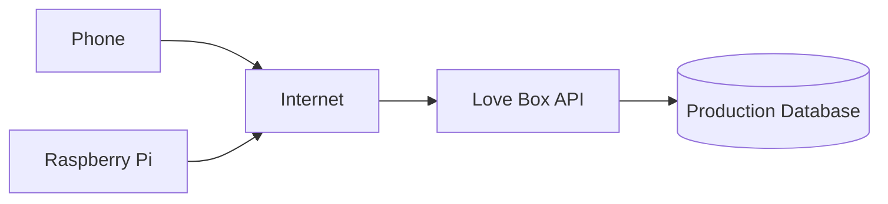

# Deployment and Security

This document describes how Love Box can move from local development to an internet-accessible service and which security measures that requires.

## Cloud Architecture

The backend currently runs on localhost:

```text
127.0.0.1:8000
```

This means only applications running on the same machine can access it directly.

Eventually, the backend needs to run on infrastructure accessible through the internet.



This will allow:

```text
Sender's phone
      ↓
Internet
      ↓
Love Box API
      ↓
Internet
      ↓
Love Box at receiver's home
```

The physical distance between sender and receiver will therefore not matter.

---

## Security

The current development API has no authentication.

That is acceptable during local development but must change before internet deployment.

Future security work will likely include:

* HTTPS
* User authentication
* Device authentication
* Device registration
* API authorization
* Secret management
* Input validation
* Rate limiting

A Raspberry Pi should eventually have its own device identity or token.

Conceptually:

```text
Raspberry Pi
     │
     │ Device Token
     ▼
Love Box API
     │
     ▼
Authorized?
  │       │
 YES      NO
  │       │
  ▼       ▼
Message   Reject
```

---
