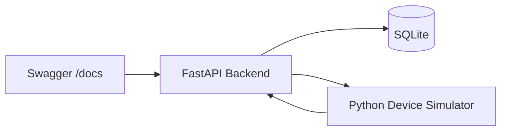
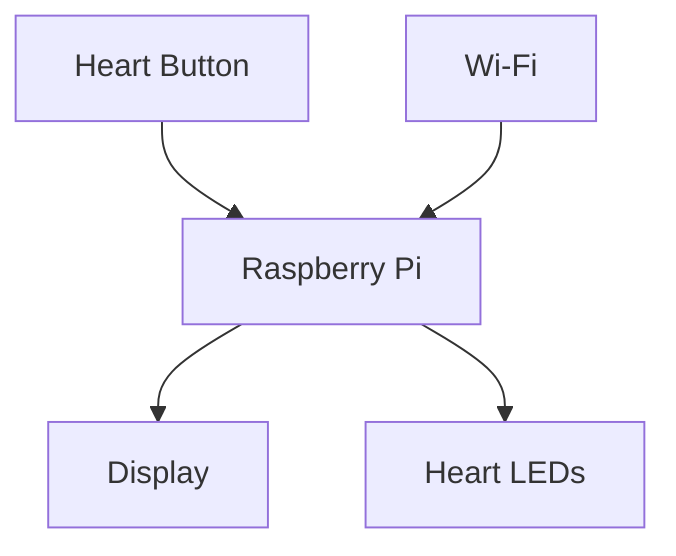
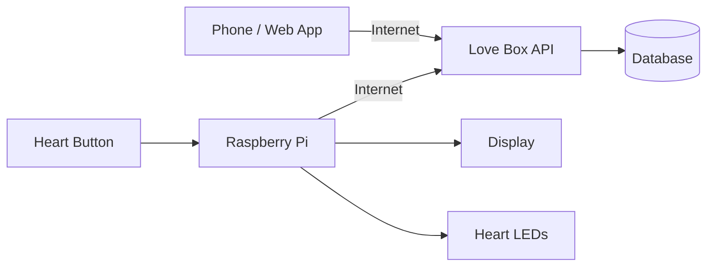
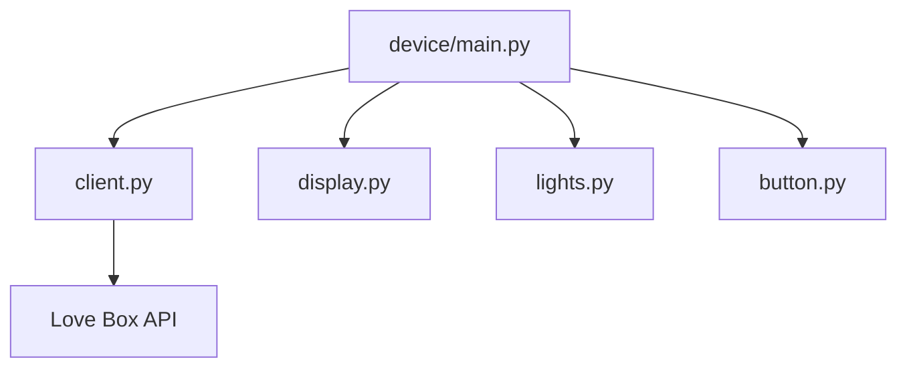

# Device Architecture

This document describes the current device simulator and the planned Raspberry Pi hardware and user experience.

## Current Development Environment

Everything currently runs locally on the development machine.



Two processes are normally running during development.

### Backend

```text
FastAPI
+
SQLite
```

### Device simulator

```text
device_simulator.py
```

The simulator behaves like the future Raspberry Pi.

It:

1. Polls the backend
2. Checks for unread messages
3. Displays the message
4. Sends an acknowledgement
5. Waits for the next message

---

## Current Device Simulator

The current Raspberry Pi simulator runs as a normal Python application.

Conceptually, it performs the following loop:

```text
START
  │
  ▼
Ask backend for message
  │
  ▼
Message available?
  │
  ├── NO ──────► Wait 2 seconds
  │                  │
  │                  └──────► Try again
  │
  └── YES
       │
       ▼
   Display message
       │
       ▼
    Send ACK
       │
       ▼
  Wait 2 seconds
       │
       └────────────► Try again
```

The terminal currently represents the physical display.

For example:

```text
==================================================
💗 LOVE BOX 💗
==================================================

Hei ❤️

Dette er første melding til simulatoren

==================================================

Message #7 acknowledged ✅
```

Later, the terminal output will be replaced by an actual graphical display.

---

## Why Use a Simulator?

Using a simulator allows most of the software to be developed before purchasing or configuring the physical Raspberry Pi.

The goal is for the same basic device logic to eventually run on the Raspberry Pi.

Today:

```text
Python
  ↓
Terminal
```

Later:

```text
Python
  ↓
Raspberry Pi
  ↓
Physical Display
```

The networking and API communication should remain largely the same.

Only the hardware-specific components need to change.

---

## Target Device Architecture

The physical Love Box will eventually contain several components.



The Raspberry Pi acts as the controller.

It will be responsible for:

* Connecting to the internet
* Communicating with the Love Box API
* Receiving messages
* Rendering messages
* Controlling LEDs
* Reading button input
* Acknowledging messages

---

## Target System Architecture

The final system will eventually look approximately like this:



This separates the project into two major sides.

---

### Sender

The sender uses a web or mobile application.

The application will allow the sender to create different kinds of messages.

Examples:

```text
💗 Compliment

📅 Date Plan

🎁 Surprise

💌 Normal Message
```

The sender application communicates with the Love Box backend.

---

### Receiver

The receiver is the physical Love Box.

The Raspberry Pi periodically checks the backend for new messages.

When a message arrives, the box can eventually:

```text
New message
     ↓
LED hearts illuminate
     ↓
Display wakes up
     ↓
Animation plays
     ↓
Message appears
     ↓
Receiver interacts with box
     ↓
Message acknowledged
```

---

## Future Display System

The current terminal display will eventually be replaced by a graphical display system.

The device code should therefore eventually be separated into components such as:

```text
device/
├── main.py
├── client.py
├── display.py
├── lights.py
└── button.py
```

### client.py

Responsible for communication with the backend.

### display.py

Responsible for rendering messages and animations.

### lights.py

Responsible for controlling LEDs.

### button.py

Responsible for physical button input.

### main.py

Coordinates all device components.

Conceptually:



This structure allows hardware implementations to change without changing the entire application.

---

## Planned Message Experience

The current simulator acknowledges messages immediately after displaying them.

This is useful during early development but will probably change.

A more interactive final experience could be:

```text
Message arrives
      ↓
Hearts begin glowing
      ↓
Screen shows notification
      ↓
User presses heart button
      ↓
Message opens
      ↓
User finishes reading
      ↓
ACK sent to backend
```

This makes acknowledgement represent an actual interaction rather than simply successful network delivery.

---

## Future Message Types

Currently every message consists of:

```text
title
body
```

Later, messages could contain a type.

For example:

```json
{
  "type": "date",
  "title": "Date night ❤️",
  "body": "Be ready at 18:00"
}
```

Possible types include:

```text
message
compliment
date
surprise
reminder
```

The display could render each type differently.

For example, a date plan could eventually contain:

```text
❤️ DATE NIGHT ❤️

18:00
Dinner

20:00
Activity

22:00
Surprise
```

while a compliment could use a simpler animated presentation.

---
