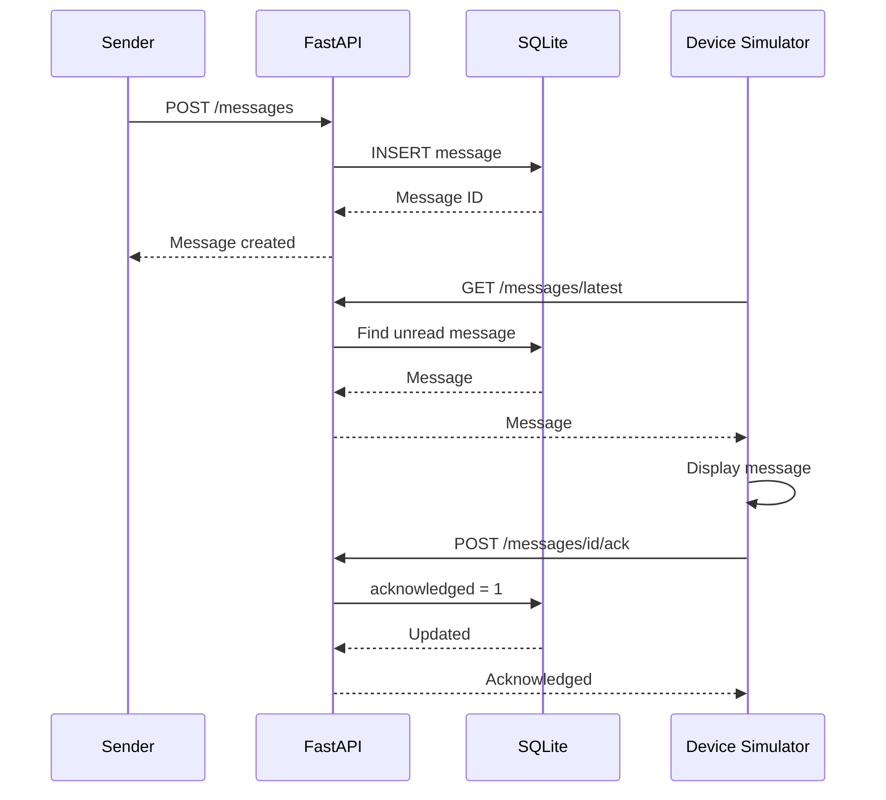

# Roadmap and Project Vision

This document tracks the planned development phases, the current status, and the long-term vision for Love Box.

## Development Roadmap

### Phase 1 – Foundation

* [x] Create Git repository
* [x] Create Python virtual environment
* [x] Configure `.gitignore`
* [x] Create FastAPI backend
* [x] Create health endpoint
* [x] Create message model
* [x] Add SQLite database
* [x] Add persistent messages
* [x] Separate API and database logic
* [x] Add message retrieval
* [x] Add latest-message endpoint
* [x] Add acknowledgement status
* [x] Add database migration
* [x] Add acknowledgement endpoint
* [x] Create Raspberry Pi simulator
* [x] Test complete message flow

---

### Phase 2 – Device Experience

* [ ] Refactor simulator into device modules
* [ ] Create graphical display simulator
* [ ] Design Love Box message screen
* [ ] Add message animations
* [ ] Add simulated heart button
* [ ] Add simulated LEDs
* [ ] Define display states
* [ ] Handle offline mode
* [ ] Handle API reconnects

---

### Phase 3 – Sender Experience

* [ ] Create sender web application
* [ ] Design message composer
* [ ] Add message types
* [ ] Add compliment layout
* [ ] Add date-plan layout
* [ ] Add surprise layout
* [ ] Add message history
* [ ] Add delivery status

---

### Phase 4 – Raspberry Pi

* [ ] Select Raspberry Pi model
* [ ] Select display
* [ ] Configure Raspberry Pi OS
* [ ] Deploy device application
* [ ] Connect physical display
* [ ] Add GPIO support
* [ ] Connect LEDs
* [ ] Connect heart button
* [ ] Configure application auto-start
* [ ] Test power-loss recovery

---

### Phase 5 – Infrastructure

* [ ] Deploy backend to cloud
* [ ] Configure domain
* [ ] Configure HTTPS
* [ ] Add authentication
* [ ] Add device registration
* [ ] Replace development database if necessary
* [ ] Add logging
* [ ] Add monitoring
* [ ] Add backups

---

## Current Status

The core communication architecture is working.

The following flow has been tested successfully:



This means the fundamental backend-to-device communication is now functional.

The next major development area is the **device experience and visual presentation**.

---

## Project Vision

The goal is to move from the current development system:

```text
Swagger
   ↓
FastAPI
   ↓
SQLite
   ↑
Python Simulator
   ↓
Terminal
```

to:

```text
Beautiful sender app
        ↓
     Internet
        ↓
   Love Box API
        ↓
     Internet
        ↓
   Raspberry Pi
     ↙   ↓   ↘
 Hearts Screen Button
```

The backend and message protocol being developed now form the foundation for the physical Love Box.
